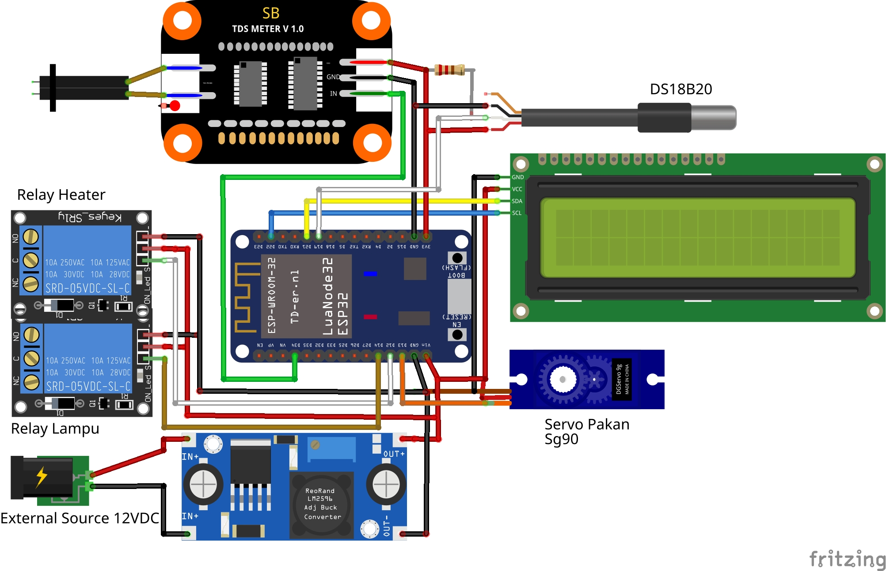
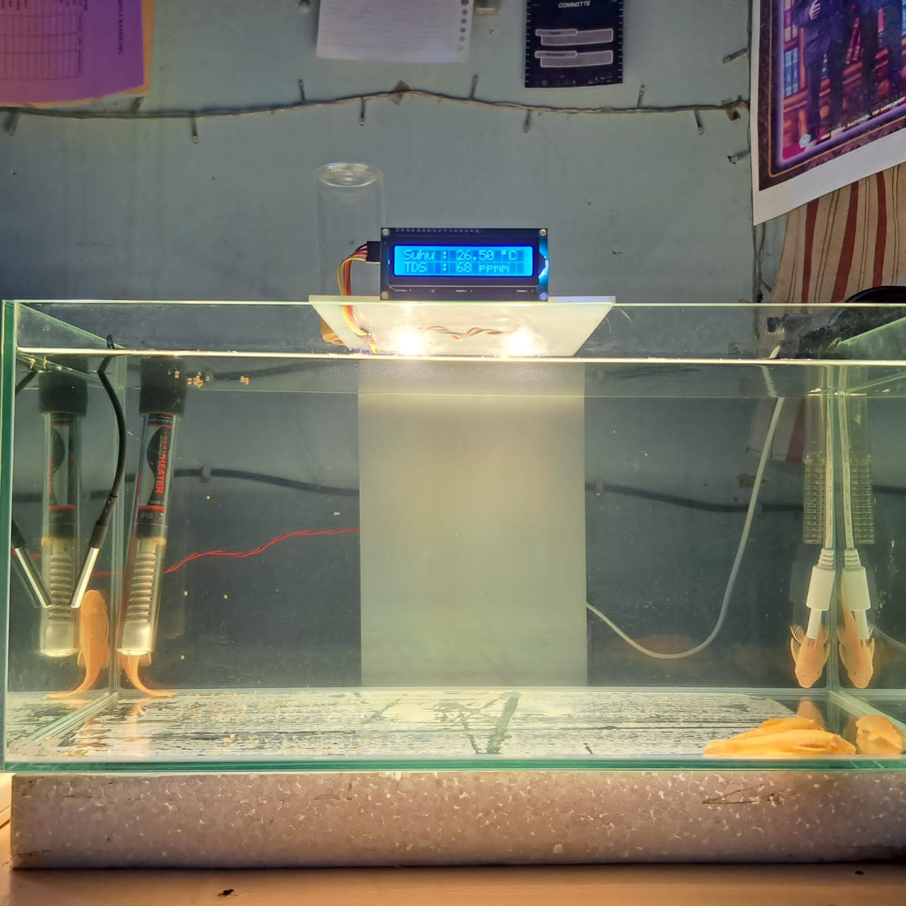
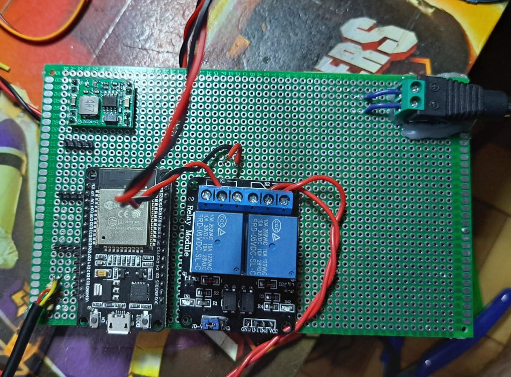
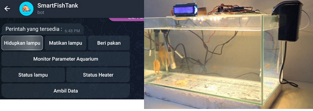
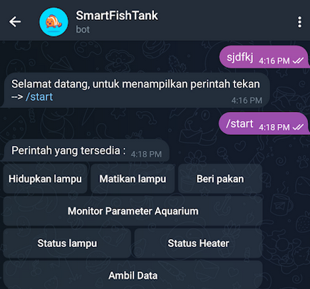
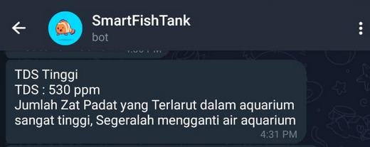
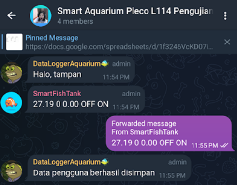

# Smart Aquarium

This project is an IoT based smart Aquarium using telegram bot as a notification and control interface.

## Features
- Reads tank temperature, TDS Value.
- Send notification if temperature/TDS reach threshold value.
- Automatic heater control based on threshold value.
- Send data to google sheet.
- Control feed servo, LED, etc. using button in telegram bot. 

## Hardware Component
- ESP32
- DS18B20 temperature sensor
- LED
- Heater
- 2 Channel relays
- Motor Servo

## Wiring Diagram

## Prototype

  
  
  

## Screenshot Telegram Bot

  
  
  

